# `data-ml` — SRHR fieldwork analysis

**What stops adolescent girls in Nairobi from using sexual and reproductive health services?**

The 12 in-depth interviews and the focus group described in `docs/`, read and coded by hand,
turned into two tables and explored with 15 charts. This is the evidence base behind the three
barriers in the root README — read it as fieldwork, not as a survey.

**Stack:** `pandas` · `numpy` · `matplotlib` · `seaborn`

Everything lives in one notebook: [`srhr_updated_full.ipynb`](srhr_updated_full.ipynb).

---

## How to run it

```bash
# 1. create the environment (only once)
python3.11 -m venv .venv

# 2. install what the notebook needs
.venv/bin/pip install numpy pandas matplotlib seaborn "ipykernel<7"

# 3. open the notebook
code srhr_updated_full.ipynb
```

In VS Code: click the kernel picker (top right) → **.venv (3.11.15.final.0)** → **Run All**.
Every cell is instant; the whole notebook runs in a few seconds.

> **Note on `ipykernel<7`.** ipykernel 7.x is not compatible with the VS Code Jupyter
> extension — the kernel starts but the UI hangs on `[*]` forever. Pin it below 7.

---

## The data

Nothing is typed into the notebook. Every number is read from a CSV, so the data can be
corrected or extended by editing a file and pressing Run All — no code change.

| file | rows | what it holds |
| --- | --- | --- |
| `data/participants.csv` | 12 | one row per interviewee: city, neighborhood, age, schooling, six barrier flags, information sources |
| `data/statements.csv` | 46 | one row per coded quote from the transcripts |
| `data/theme_categories.csv` | 22 | groups the 22 fine themes into 4 broad categories |
| `data/source_codes.csv` | 7 | `0 = AI`, `1 = Family`, `2 = Social media` … |
| `data/barrier_labels.csv` | 6 | the readable name of each barrier column |
| `data/data_dictionary.csv` | 23 | what every participant column means |

**All six live in `data/`, and the notebook reads every one of them with `pd.read_csv`.**
Nothing is typed into a code cell. To correct a number, add a girl, or rename a barrier, edit
the CSV and press Run All — the charts redraw themselves.

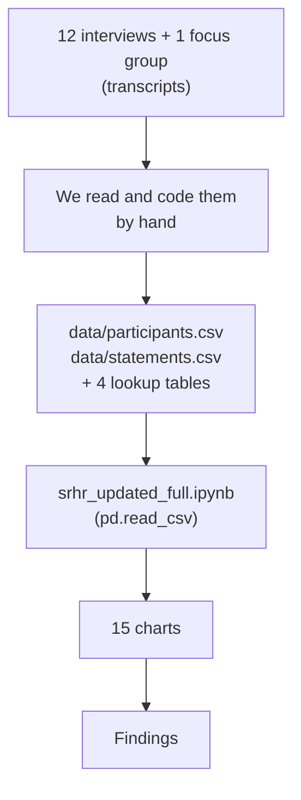

### Locations are neighborhoods, not cities

**All 12 girls live in Nairobi.** Kibera, Embakasi, Kileleshwa, Buruburu and Langata are
estates *inside* the city — the way Brooklyn and the Bronx are inside New York City. An
earlier version of the dataset had a single `location_nairobi` flag, which made Kibera read
as though it were somewhere else. The updated file has `city` and `neighborhood` instead.

| neighborhood | interviewees |
| --- | --- |
| Kibera | 7 |
| Kileleshwa | 2 |
| Buruburu | 1 |
| Embakasi | 1 |
| Langata | 1 |

### The six barriers, and what each one really means

Each barrier is a yes/no per girl, so **summing the column counts the girls who raised it**.

| label | a `1` means | girls |
| --- | --- | --- |
| **Stigma** | girls are judged for seeking SRHR services | 12 |
| **Low awareness** | girls do not know what exists or how it works | 8 |
| **Cost** | money stops her — the service, the clinic card, or the fare | 7 |
| **Provider judgment** | a nurse or doctor shamed or dismissed her | 6 |
| **Distance / unequal access** | *where you live changes the care you get* | 4 |
| **Religious teaching** | a religious rule or teaching stands in the way | 4 |

Two of these labels were corrected in this version:

- **`Distance/rural` → `Distance / unequal access`.** Nobody in this study lives rurally.
  Two of the four quotes behind this flag are Nairobi-against-Nairobi — Kibera against
  Muthaiga, Westlands against here. Two are girls describing women elsewhere. "Rural" was
  the wrong word for what the girls actually described.
- **`Religion` → `Religious teaching`.** Clearer, and it is genuinely in the transcripts —
  one quote names Islam directly.

The underlying column is still called `barrier_distance_rural` — that is the name it was
coded with, and renaming it would break the link to `data/data_dictionary.csv`. Only the
display label changed, and it changed by editing `data/barrier_labels.csv`, not a line of code.

### `-1` means "we don't know"

Two columns use `0 = low`, `1 = medium`, `2 = high`, `-1 = unknown`. The notebook turns every
`-1` into `NaN` before anything is averaged, and the first chart in the notebook shows how
complete each column is. `trusts_social_media_ord` is unknown for **9 of 12 girls**, so we
build nothing on it. The same goes for `uses_ai`, which is true for exactly one girl.

---

## What the girls said

These are the 46 coded statements — **condensed by us while reading the transcripts, not
word-for-word quotes.** `IDI` = individual interview, `FGD` = focus group. Names shown are
the ones used in the transcripts.

### Stigma and secrecy — 14 statements

> *"Community assumes girls seeking SRHR want sex only."* — Hope, IDI
>
> *"If a woman seeks these services they call you a prostitute."* — P07, IDI
>
> *"The local nurse might be your neighbour and tell everyone."* — P07, IDI
>
> *"By evening the whole neighbourhood will know you went for family planning."* — P10, IDI
>
> *"The family will judge you and tell you to go back where you came from."* — P06, IDI
>
> *"They are afraid of humiliation and of knowing their status."* — P12, IDI
>
> *"Massive stigma brings fear; girls hesitant to seek services."* — Lurit, IDI
>
> *"A lot of judgment if you look for family planning as a young girl."* — P11, IDI
>
> *"Contraception attracts more criticism than counselling."* — Johari, IDI
>
> *"Secrecy passed down in families is its own harm."* — Cindy, IDI
>
> *"Stigma is highest for HIV testing, then contraception, then counselling."* — focus group
>
> *"Contraceptive implants labelled immoral; pads wrapped in newspaper."* — focus group
>
> *"Boys are left out of the education, and judged for buying condoms."* — focus group
>
> *"Felt safer in a group than one-on-one with an unfamiliar provider."* — focus group

### How providers treat them — 6 statements

> *"The nurse shamed her: opening your legs instead of your books."* — Hope, IDI
>
> *"Some doctors judge underage girls and don't listen."* — P06, IDI
>
> *"The nurse said 'even you?' when a girl went for a pregnancy test."* — P07, IDI
>
> *"They lecture you: you are so young, where is your husband."* — P10, IDI
>
> *"A UTI was misdiagnosed as an STI; reproductive issues are assumed sexual."* — focus group
>
> *"Provider behaviour and confidentiality change faster than culture."* — Cindy, IDI

That last one from Cindy is the hopeful line in the whole dataset, and worth saying out loud:
you cannot change a community's culture quickly, but you *can* change how one nurse behaves.

### Structural barriers — cost, awareness, faith, address — 16 statements

> *"Financial constraints are a major barrier."* — Konana, IDI
>
> *"Even if the service is free you need money for a card or transport."* — P10, IDI
>
> *"Their poor background and ignorance make it difficult."* — P09, IDI
>
> *"Many are not aware these services exist, or that they cost so much."* — P08, IDI
>
> *"SRHR is misunderstood as synonymous with sexual activity."* — focus group
>
> *"Kibera girls are dismissed; Muthaiga girls get fast, good care."* — Hope, IDI
>
> *"Girls in Westlands pay private hospitals; here poverty exposes you."* — P10, IDI
>
> *"In rural areas the services are inaccessible."* — Lurit, IDI
>
> *"Pastoralist and some Muslim communities face compounded barriers."* — focus group
>
> *"Islam access restricted by the gender of the provider."* — Konana, IDI
>
> *"Religious teaching discourages contraception."* — focus group
>
> *"Beliefs that women give birth at home with witch doctors instil fear."* — P11, IDI
>
> *"A classmate had an unsafe abortion and dropped out of her course."* — P08, IDI
>
> *"FGM complications cause shame that discourages care seeking."* — focus group
>
> *"They value preventive care but only seek help once symptomatic."* — focus group
>
> *"Needs comprehensive sex ed, not abstinence only."* — Hope, IDI

### Where they go for information — 10 statements

> *"Mostly I go to Google; it will not judge me and there is privacy."* — P07, IDI
>
> *"Girls prefer anonymous AI tools over family or health workers."* — Hope, IDI
>
> *"Relies on AI more than a sibling — but AI can be manipulated."* — focus group
>
> *"I go to my peers first; we are the same age so we won't judge."* — P09, IDI
>
> *"We seek help from social media and trusted friends."* — P11, IDI
>
> *"Online communities lower the barrier to learning."* — focus group
>
> *"I read validated medical books online from certified sources."* — P08, IDI
>
> *"Seeks guidance from mother and aunts; lower judgment than clinics."* — Johari, IDI
>
> *"We visit the chemist because we fear hospitals will ask for more money."* — P12, IDI
>
> *"Mostly I take myself to the clinic or hospital and ask."* — P06, IDI

**Read that last one against the other nine.** Exactly one girl in twelve names a clinic as
her first stop. Everyone else goes to a search engine, a friend, a relative, or a chemist
first — and several say plainly why: *it will not judge me*.

---

## The charts

All 15, written to `figures/` at 200 dpi every time the notebook runs. Colours were checked with
a colour-blindness simulator, every bar carries its number, and the two heatmaps use one hue
going light → dark so darker always means more.

### Who we spoke to

**01 — How complete are the two trust columns?** *Before any finding: how much of each column do we actually have?*
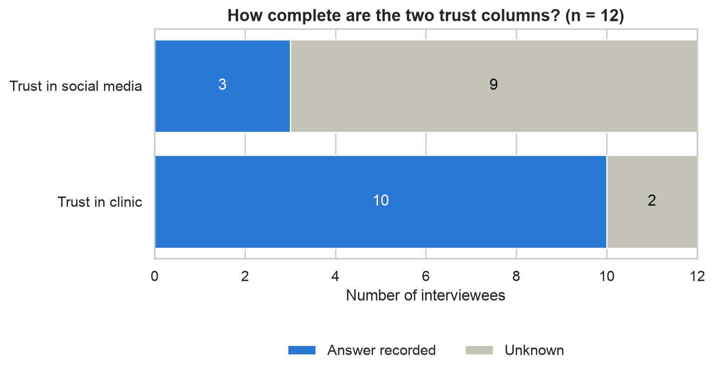

**02 — Trust in the clinic** *What the ten who answered said, with "never asked" kept visible.*
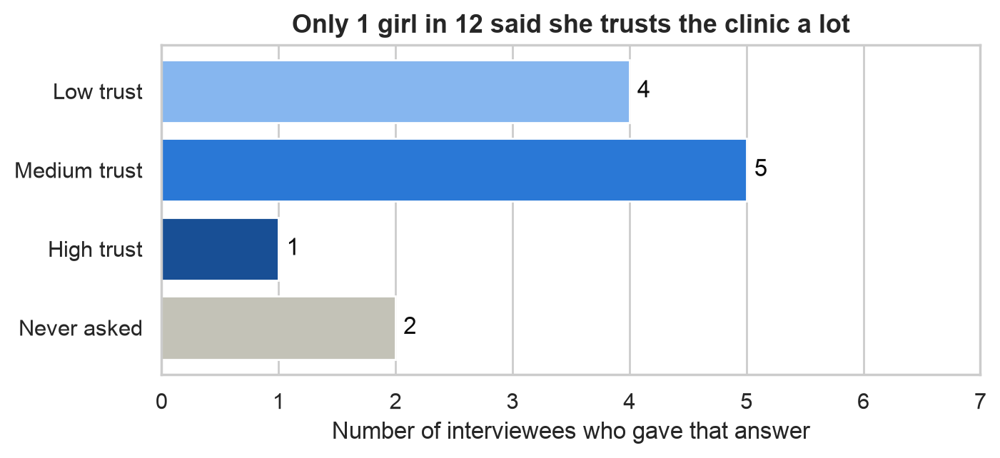

**03 — Interviewees by neighborhood** *Kibera is 7 of the 12. Read every later comparison against this.*
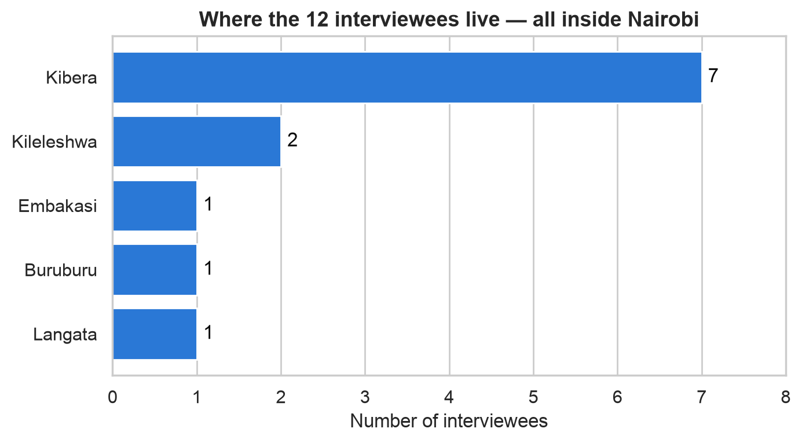

### The barriers

**04 — Barriers raised, out of 12** *Stigma is the only unanimous answer.*
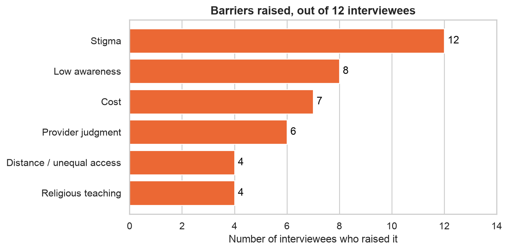

**05 — Barriers carried by each girl** *Counts girls, not barriers — the lightest load is two.*
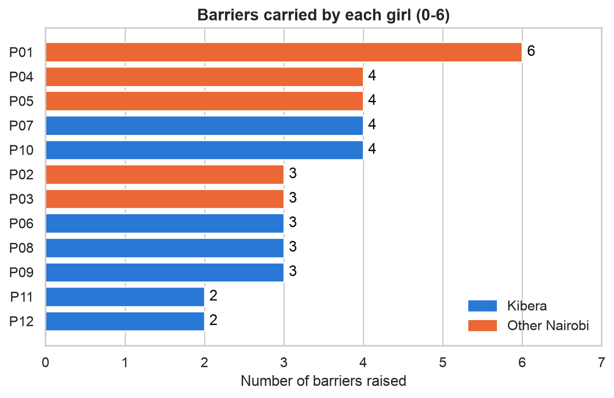

**06 — Who raised which barrier** *Every girl and every barrier in one grid.*
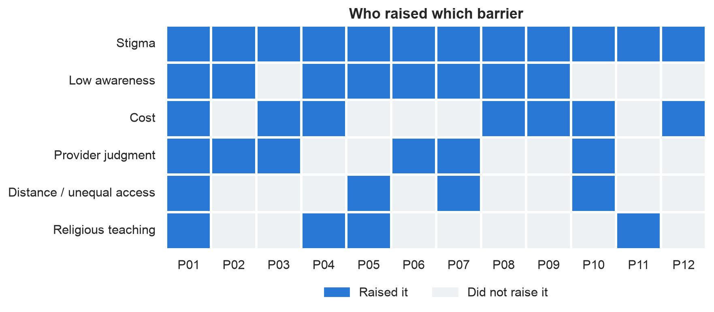

**07 — Barriers by neighborhood** *Rows are labelled with their `n`, because one of them is a single girl.*
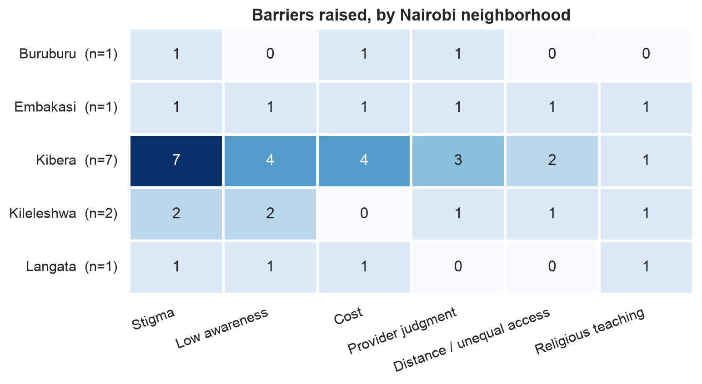

**08 — Which barriers land on the same girl** *The stigma row is automatic; the other five are where the information is.*
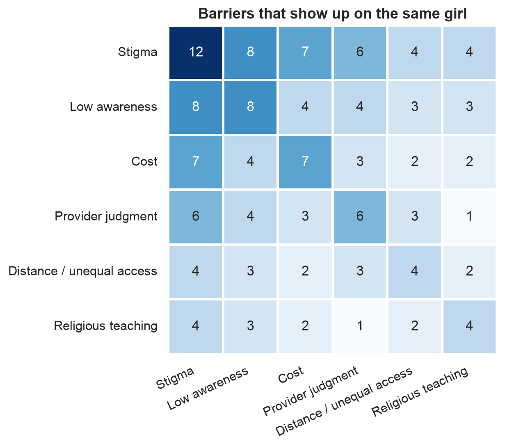

**09 — The other six yes/no answers** *Everything else we recorded per girl.*
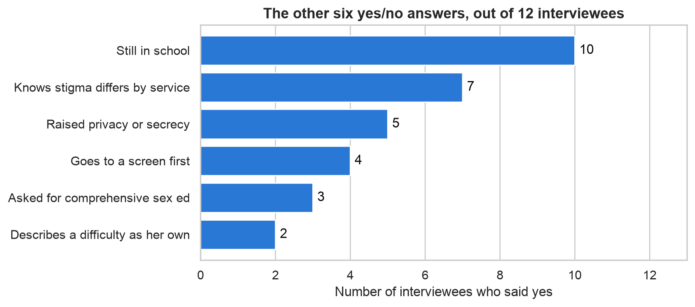

### Where they go, and whether age matters

**10 — Where she goes first** *The clinic is one girl's first stop.*
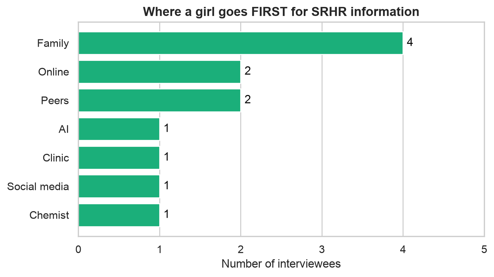

**11 — First stop, by type** *Ten of twelve go to a person or a screen.*
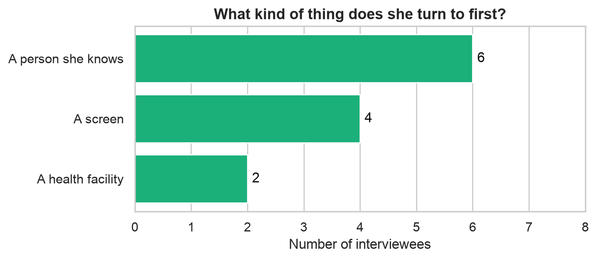

**12 — Age vs. number of barriers** *n = 12, so this is for spotting a shape, never for proving one.*
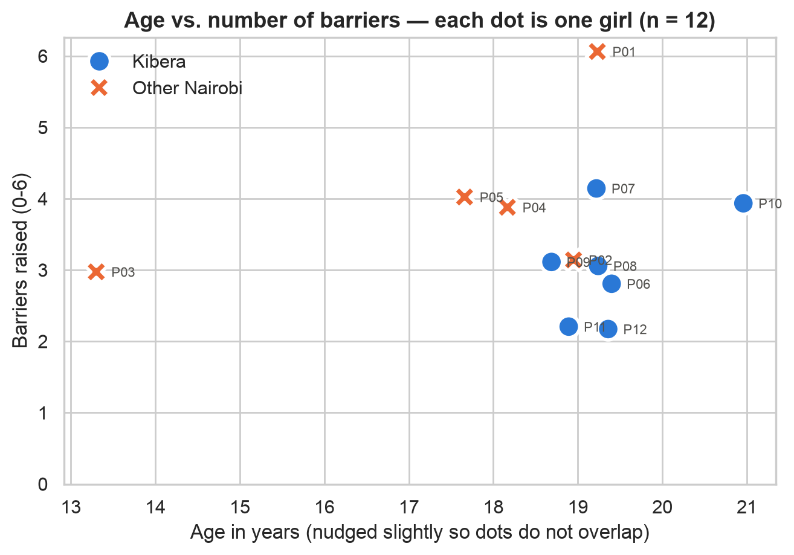

### What the 46 statements are made of

**13 — Statements per category** *The four broad groups.*
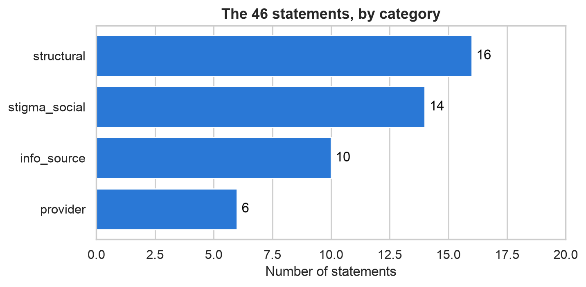

**14 — The 10 most common themes** *Unpacking those categories.*
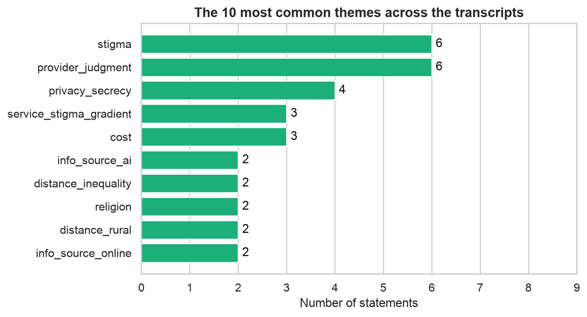

**15 — How often does a word repeat?** *Why we are not putting a text model on this yet.*
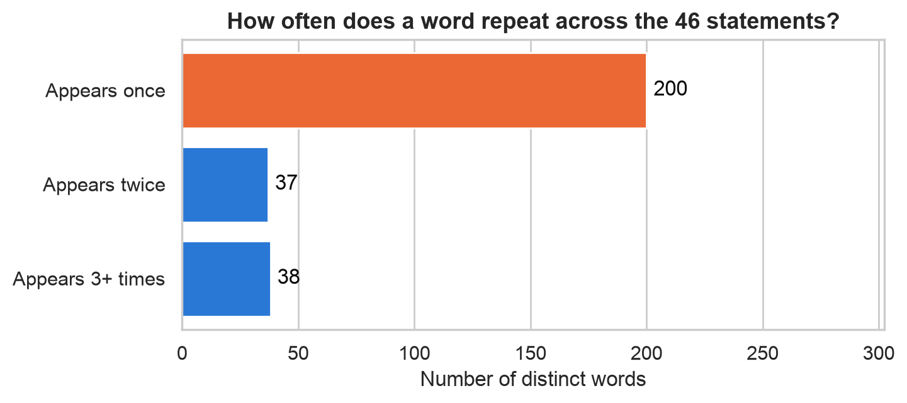

---

## Findings

These come from the charts, and they hold up.

1. **Stigma is universal in this sample.** 12 of 12 — the only unanimous answer in the whole
   dataset.
2. **After stigma come low awareness (8 of 12) and cost (7 of 12).**
3. **Barriers stack.** No girl named only one — the lightest load is two barriers, the heaviest
   six. The co-occurrence grid adds nothing on top of that: stigma is 12 of 12, so every stigma
   overlap is automatic, and among the other five the largest overlap is 4 of 12.
4. **Where you live changes the care you get — inside one city.** Kibera dismissed, Muthaiga
   seen quickly, Westlands able to pay private.
5. **Girls route around judgment.** The clinic is the first stop for exactly one girl.
6. **She goes where she trusts.** First stop and most-trusted source are the same answer for
   all 12 girls, so routing around the clinic is a belief about the clinic, not a problem of
   getting to one.
7. **Age explains nothing.** The youngest girl carries 3 barriers and the oldest carries 4, and
   the rank correlation across all 12 is −0.06.
8. **Kibera is 7 of the 12 interviews.** Every neighborhood comparison here describes who we
   spoke to, not the neighborhoods themselves.

---

## Limitations

- 12 interviews and 1 focus group. **Qualitative research, not a survey.** Nothing here
  generalises to Nairobi as a whole.
- Kibera 7, Kileleshwa 2, and one girl each for Buruburu, Embakasi and Langata. A single row
  is a story, not a rate.
- We assigned the theme of every quote ourselves. A different pair of readers would code some
  of them differently.
- `trusts_social_media_ord` is unknown for 9 of 12 girls; `uses_ai` is true for 1. We build
  nothing on either.
- The statements above are **our condensed coding of what was said**, not verbatim transcript.
- `first_info_source_code` and `main_trusted_source_code` are identical in all 12 rows. We
  report that as finding 6, but it is also what two questions coded from a single answer would
  look like. Confirm they were coded independently before quoting it.

---

## What we would do next

### On the dataset

1. **Code more transcripts.** Every table is read from a CSV, so adding rows and pressing Run
   All is the whole job — no code changes. This is the one that unlocks everything else.
2. **Widen the neighborhoods.** More interviews in Buruburu, Embakasi and Langata would turn
   every `n=1` row in the heatmap into something we can actually compare.
3. **Fill in the trust questions.** `trusts_social_media_ord` is blank for 9 of 12 girls
   because it was never asked consistently. Putting it in the interview guide costs nothing.
4. **Split `Distance / unequal access` into two columns** — unequal care between Nairobi
   addresses is a different thing from services being physically far away.
5. **Have a second person code the statements** and measure where the two readers disagree.
   That is what turns our coding from a judgment call into a method.

### On the machine-learning part

We deliberately have **no model in this notebook yet**, and the reason is measured rather than
assumed: of the 275 distinct words across the 46 statements, **200 appear exactly once**. The
words that repeat most are `and`, `a`, `the`, `you` — only the meaningless ones are common
enough to learn from. A classifier would be reading sentences made of words it has never met.

When there are enough transcripts, the plan is:

1. **Aim for roughly 150–200 coded statements** — that is where repeated vocabulary starts.
2. **Set a baseline first.** A `DummyClassifier` that always answers the biggest category
   scores about 35% here. Any model has to beat that on a test set it has never seen.
3. **TF-IDF + RandomForest**, tuned with `GridSearchCV` on the training split only, scored
   once at the end on the held-out test set.
4. **Report the result straight, including a bad one.** A model that barely beats the baseline
   is a finding about dataset size, not a broken pipeline — and a model scoring suspiciously
   well on 46 sentences would be leaking, not learning.
5. **Predict the barrier, not the category.** Reading a girl's concern and flagging *which
   barrier she is facing* is what would actually route her to the right kind of help.

---

## Repository structure

```text
data-ml/
├── README.md                   <- you are here
├── srhr_updated_full.ipynb     <- the project: 82 cells, 15 charts
├── data/
│   ├── participants.csv        <- the 12 interviewees, with neighborhoods
│   ├── statements.csv          <- the 46 coded quotes
│   ├── theme_categories.csv    <- 22 themes -> 4 categories
│   ├── source_codes.csv        <- 0 = AI, 1 = Family, ...
│   ├── barrier_labels.csv      <- readable name for each barrier
│   └── data_dictionary.csv     <- what every column means
├── figures/                    <- the 15 charts, written by the notebook, shown above
                                (.venv/ and caches are covered by the repo root .gitignore)
```

That is the whole project. Every file in it is either read by the notebook or written by it.

`.venv/` is excluded by `.gitignore` and should never be committed. Anyone cloning this
rebuilds it with the install command above.
